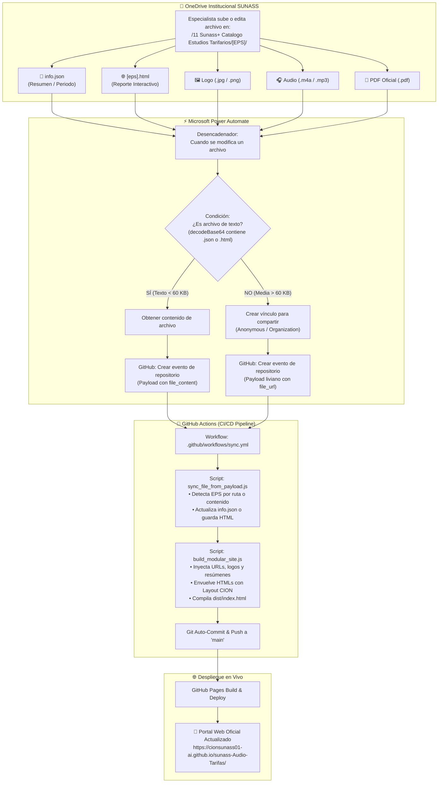

# 📚 Manual de Arquitectura Cloud y Guía de Actualización de Estudios Tarifarios
### SUNASS · Centro de Inteligencia de Operaciones (CION)

---

## 📑 Tabla de Contenidos
1. [Visión General del Sistema](#1-visión-general-del-sistema)
2. [Arquitectura Cloud y Flujo de Datos](#2-arquitectura-cloud-y-flujo-de-datos)
3. [Estrategia de Payload Ultraliviano (0 MB)](#3-estrategia-de-payload-ultraliviano-0-mb)
4. [Guía para el Usuario / Especialista de SUNASS](#4-guía-para-el-usuario--especialista-de-sunass)
5. [Guía Técnica para el Desarrollador](#5-guía-técnica-para-el-desarrollador)
6. [Estructura del Proyecto y Archivos Clave](#6-estructura-del-proyecto-y-archivos-clave)
7. [Preguntas Frecuentes y Solución de Problemas (Troubleshooting)](#7-preguntas-frecuentes-y-solución-de-problemas-troubleshooting)

---

## 1. Visión General del Sistema

El **Portal de Estudios Tarifarios de SUNASS** es una plataforma web modular, estática y reactiva que centraliza la información regulatoria, interactiva, sonora y documental de las **50 Empresas Prestadoras de Servicios de Saneamiento (EPS)** del Perú.

El portal implementa una **Arquitectura Híbrida Cloud (Serverless & Event-Driven)** que conecta:
* **Microsoft OneDrive / SharePoint Institucional:** Donde los especialistas de SUNASS gestionan archivos sin tocar código.
* **Microsoft Power Automate:** Orquestador de eventos en tiempo real.
* **GitHub Actions:** Motor de compilación, inyección de metadatos y control de versiones.
* **GitHub Pages / CDN:** Infraestructura de despliegue de alta disponibilidad y velocidad.

```
+-----------------------------------------------------------------------------------+
|                            PORTAL DE ESTUDIOS TARIFARIOS                          |
|                                                                                   |
|   🎧 Resúmenes en Audio    📄 Estudios Oficiales PDF    📊 Reportes Interactivos   |
|   🖼️ Logos Institucionales 📝 Resúmenes Ejecutivos      ⚡ Búsqueda y Filtros      |
+-----------------------------------------------------------------------------------+
```

---

## 2. Arquitectura Cloud y Flujo de Datos



---

## 3. Estrategia de Payload Ultraliviano (0 MB)

### ⚠️ El Reto Técnico: Límite de 64 KB de GitHub API
La API de GitHub `repository_dispatch` tiene un límite estricto de **64 KB** por mensaje. Si un usuario sube un archivo de audio (9 MB), un PDF (10 MB) o una imagen (1.5 MB) en Base64, el webhook falla con el error:
> `422 Unprocessable Entity: client_payload is too large.`

### ✅ La Solución Implementada: Transmisión Selectiva
El flujo de Power Automate bifurca el tratamiento según el tipo de dato:

| Tipo de Archivo | Ruta en Power Automate | ¿Qué viaja por Webhook? | Peso del Payload |
|---|---|---|---|
| 📝 **`info.json`** | Rama Verde (`True`) | Contenido de texto en Base64 | ~1 KB |
| 🌐 **`[eps].html`** | Rama Verde (`True`) | Contenido HTML en Base64 | ~45 KB |
| 🖼️ **Logo (`.jpg`/`.png`)** | Rama Roja (`False`) | **Solo la URL de SharePoint (`file_url`)** | **~200 bytes** |
| 🎧 **Audio (`.m4a`/`.mp3`)** | Rama Roja (`False`) | **Solo la URL de SharePoint (`file_url`)** | **~200 bytes** |
| 📄 **PDF (`.pdf`)** | Rama Roja (`False`) | **Solo la URL de SharePoint (`file_url`)** | **~200 bytes** |

---

## 4. Guía para el Usuario / Especialista de SUNASS

No necesitas instalar programas ni saber programación. Todo se gestiona desde **OneDrive institucional**.

### 📂 Ubicación de Trabajo:
Entra a tu OneDrive en el navegador y abre la carpeta:  
📁 **`11 Sunass+ Catalogo Estudios Tarifarios`**

Dentro encontrarás una carpeta para cada una de las 50 EPS (por ejemplo: `EMSAPUNO S.A`, `24. EMAPA HUARAL SA`, `EPS ILO S.A`, etc.).

---

### 📝 Caso A: Actualizar el Resumen o Periodo de una EPS
1. Entra a la carpeta de la EPS (ej. `EMSAPUNO S.A`).
2. Abre el archivo **`info.json`** (puedes editarlo en el navegador).
3. Modifica los campos que necesites:
   ```json
   {
     "nombre": "EMSAPUNO S.A.",
     "periodo": "2023 - 2027",
     "resumen": "Escribe aquí el nuevo resumen ejecutivo del estudio tarifario..."
   }
   ```
4. Guarda el archivo.
5. **¡Listo!** En aproximadamente **20 segundos**, el nuevo resumen aparecerá en el portal web.

---

### 🖼️ Caso B: Cambiar el Logo de la EPS
1. Entra a la carpeta de la EPS.
2. Sube la imagen del nuevo logo (formato `.jpg`, `.png` o `.webp`).
3. **¡Listo!** El sistema detectará la nueva imagen, generará su enlace institucional y la colocará en la tarjeta de la EPS.

---

### 🎧 Caso C: Subir o Actualizar el Audio del Estudio
1. Entra a la carpeta de la EPS.
2. Sube el archivo de audio (formato `.m4a`, `.mp3` o `.wav`).
3. **¡Listo!** El botón **"Escuchar audio"** de esa EPS reproducirá automáticamente el nuevo audio.

---

### 📄 Caso D: Subir o Actualizar el PDF Oficial del Estudio
1. Entra a la carpeta de la EPS.
2. Sube el documento del estudio tarifario en formato `.pdf`.
3. **¡Listo!** El botón **"Descargar PDF"** descargará directamente el nuevo archivo oficial.

---

### 🌐 Caso E: Subir un Reporte / Calculadora Interactiva HTML
1. Entra a la carpeta de la EPS.
2. Sube el archivo `.html` con los gráficos, tablas o calculadoras interactivas.
3. **¡Listo!** El botón **"Reporte informativo"** abrirá el nuevo reporte con la cabecera y pie de página institucional de SUNASS.

---

## 5. Guía Técnica para el Desarrollador

Esta sección explica cómo funciona el código interno y cómo extender el sistema.

### ⚙️ Flujo del Pipeline en GitHub Actions (`.github/workflows/sync.yml`)

1. **Trigger:** Se activa ante el evento `repository_dispatch` con tipo `sharepoint_sync`.
2. **Ejecución de `sync_file_from_payload.js`:**
   * Lee `client_payload` desde `$GITHUB_EVENT_PATH`.
   * Si la ruta o el nombre vienen en Base64 desde Power Automate, los decodifica automáticamente.
   * Identifica la carpeta de la EPS destino mediante:
     1. Coincidencia exacta del nombre de la carpeta padre en OneDrive.
     2. Puntuación de coincidencia difusa normalizada (eliminando tildes, números iniciales y sufijos como `S.A.`, `EPS`).
     3. Fallback: Deducción automática leyendo el campo `"nombre"` dentro del JSON recibido.
   * Si es **Logo/Audio/PDF**, actualiza las propiedades `logo_url`, `audio_url` o `pdf_url` en `eps/[carpeta]/info.json`.
   * Si es **HTML**, guarda el archivo en `eps/[carpeta]/[nombre].html`.
   * Si es **JSON**, fusiona las claves nuevas con las existentes preservando URLs anteriores.
3. **Ejecución de `build_modular_site.js`:**
   * Recorre las 50 carpetas en `eps/`.
   * Envuelve fragmentos HTML individuales con el Layout Institucional CION (Google Fonts Inter, TailwindCSS, FontAwesome, Nav de retorno y Footer oficial).
   * Inyecta resúmenes en `<div id="summary-[key]">` de cada tarjeta en `index.html`.
   * Inyecta periodos en el badge de cada tarjeta.
   * Inyecta las URLs de SharePoint en los botones `onclick="playAudio('...')"` y `<a href="...download=1">`.
   * Genera los archivos en `dist/` y los replica a la raíz para despliegue instantáneo.
4. **Git Auto-Commit:**
   * Hace `git add .` y si detecta cambios, realiza commit con el nombre del bot: `CION Automation Bot <cion_sunass@sunass.gob.pe>`.
   * Empuja a la rama `main`, lo que dispara automáticamente el despliegue de **GitHub Pages**.

---

### 💻 Cómo probar y compilar localmente

Para compilar y verificar el portal en tu entorno local:

```bash
# 1. Clonar el repositorio
git clone https://github.com/cionsunass01-ai/sunass-Audio-Tarifas.git
cd sunass-Audio-Tarifas

# 2. Instalar dependencias (si aplica)
npm install

# 3. Compilar el portal modular completo
node build_modular_site.js

# 4. Copiar compilado a la raíz
node copy_dist_to_root.js

# 5. Abrir index.html en tu navegador o usar un servidor local
npx serve .
```

---

### ➕ Cómo agregar una nueva EPS al catálogo

Si SUNASS incorpora una nueva EPS (por ejemplo: `EPS NUEVA S.A.`):

1. **En la carpeta `eps/` local:**
   Crea la carpeta `eps/eps-nueva/` con su archivo `info.json`:
   ```json
   {
     "key": "epsnueva",
     "slug": "eps-nueva",
     "nombre": "EPS NUEVA S.A.",
     "region": "Lima",
     "macroregion": "Centro",
     "periodo": "2026 - 2030",
     "resumen": "Resumen del nuevo estudio tarifario...",
     "html_archivo": "eps-nueva.html",
     "audio_url": "",
     "pdf_url": "",
     "logo_url": ""
   }
   ```
2. **En OneDrive:**
   Crea la carpeta `/11 Sunass+ Catalogo Estudios Tarifarios/EPS NUEVA S.A/` y coloca sus archivos.
3. **Ejecutar compilación:**
   `node build_modular_site.js` y hacer `git push`. ¡El sistema la indexará automáticamente!

---

## 6. Estructura del Proyecto y Archivos Clave

```
sunass-portal/
├── .github/
│   └── workflows/
│       └── sync.yml              # Pipeline de GitHub Actions (Webhook Receiver)
├── eps/                          # 50 carpetas modulares de EPS
│   ├── emsapuno/
│   │   ├── info.json             # Metadatos, resumen, URLs de SharePoint
│   │   └── emsapuno.html         # Reporte interactivo / Calculadora
│   ├── Emapa-Huaral/
│   ├── EPS-Ilo/
│   └── ... (50 EPS)
├── dist/                         # Artefactos compilados listos para producción
│   ├── index.html                # Catálogo principal con tarjetas actualizadas
│   └── [eps].html                # Reportes individuales con layout oficial
├── sync_file_from_payload.js     # Procesador del Webhook de Power Automate
├── build_modular_site.js         # Compilador e inyector modular de datos
├── build_static_site.js          # Compilador base estático
├── copy_dist_to_root.js          # Sincronizador de dist/ a raíz
├── index.html                    # Página de entrada para GitHub Pages
└── MANUAL_ARQUITECTURA...md     # Este manual técnico y de usuario
```

---

## 7. Preguntas Frecuentes y Solución de Problemas (Troubleshooting)

### P1: Modifiqué un archivo en OneDrive y no se ve en la web.
* **Causa 1 (Caché del navegador):** El portal se actualizó, pero tu navegador guarda la versión anterior.  
  👉 **Solución:** Presiona `Ctrl + F5` (o `Cmd + Shift + R` en Mac) para forzar la recarga limpia.
* **Causa 2 (Tiempo de compilación):** El ciclo completo toma entre 15 y 35 segundos. Espera medio minuto antes de recargar.

### P2: ¿Cómo verificar si el flujo se ejecutó correctamente?
1. **En Power Automate:** Entra a **Mis flujos** ➔ `Sincronizar Portal — Al MODIFICAR en OneDrive` ➔ Revisa el **Historial de ejecuciones de 28 días**. Debe marcar **Correcto 🟢**.
2. **En GitHub:** Entra a [GitHub Actions](https://github.com/cionsunass01-ai/sunass-Audio-Tarifas/actions). Debe figurar el evento `sharepoint_sync` con check verde 🟢 seguido de `pages build and deployment`.

### P3: ¿Por qué no subimos los audios y PDFs directamente a Git?
Git está diseñado para código fuente y texto. Subir archivos binarios pesados (audios de 9 MB, PDFs de 10 MB) saturaría el repositorio rápidamente y violaría el límite de 64 KB de webhooks. Usar **enlaces institucionales de Microsoft SharePoint** aprovecha la red de alta velocidad y CDN de Microsoft para streaming de audio y descargas rápidas, manteniendo el portal ligero y ultra veloz.

---

**Centro de Inteligencia de Operaciones (CION) · SUNASS**  
*Información pública para mejores decisiones.*
