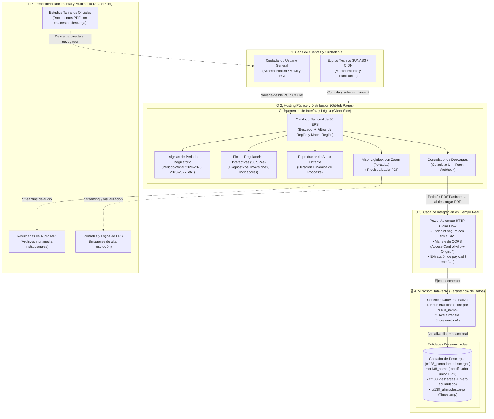
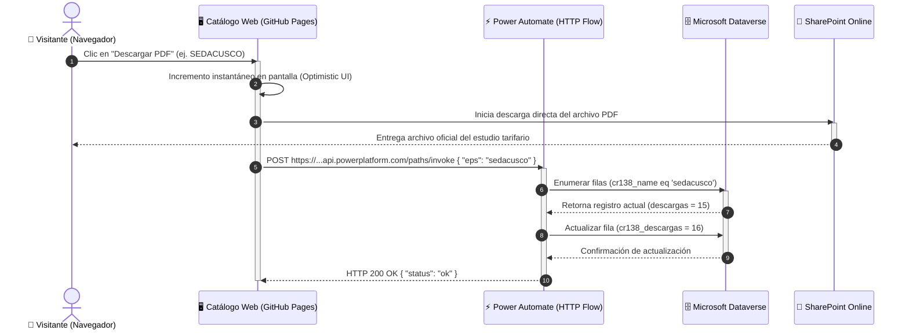

# Diagramas de Arquitectura del Sistema y Flujo de Datos
## Sunass Plus — Portal de Estudios Tarifarios (SUNASS)

**Institución:** Superintendencia Nacional de Servicios de Saneamiento (SUNASS) — Equipo CION  
**Versión del documento:** 2.5  
**Fecha de actualización:** 2026-08-25  

Este documento contiene las representaciones visuales y técnicas de la arquitectura de la solución tecnológica y los flujos de datos e interacción entre los componentes clave: **GitHub Pages**, **Microsoft Power Automate**, **Microsoft Dataverse** y el **Repositorio Documental (SharePoint)**.

---

## 1. Diagrama de Arquitectura General del Sistema

El siguiente diagrama ilustra las capas arquitectónicas del portal, desde el acceso ciudadano y roles de usuario, pasando por la distribución estática de alta velocidad, hasta el puente de integración con Power Automate y la base de datos empresarial Dataverse.

---

## 2. Diagrama de Secuencia: Flujo de Descarga y Conteo en Vivo

El siguiente diagrama detalla la secuencia exacta que se produce cada vez que un ciudadano descarga el estudio tarifario de una EPS:

---

## 3. Diagrama del Pipeline de Compilación Estática (`build_static_site.js`)

```mermaid
flowchart LR
    subgraph FUENTES ["📂 Código Fuente Original"]
        SRC_PAGES["web-pages/ (50 carpetas de EPS + Principal)"]
        SRC_FILES["web-files/ (CSS, Logos e Imágenes)"]
        SRC_TMPL["web-templates/ (Footer institucional)"]
    end

    subgraph COMPILADOR ["⚙️ Motor Node.js (build_static_site.js)"]
        PARSE["1. Mapeo y parsing de YAML/HTML"]
        TRANSFORM["2. Normalización de URLs a relativas (.html)"]
        RESPONSIVE["3. Inyección de reglas CSS Responsivas Móviles"]
        PERIODS["4. Inyección de Badges de Periodo Oficial"]
        FOOTER["5. Ensamble de Footer Institucional"]
        SYNC["6. Conexión de Webhook Power Automate"]
    end

    subgraph DIST ["🚀 Directorio de Salida (dist/)"]
        DIST_INDEX["index.html (Página Principal)"]
        DIST_EPS["50 archivos <slug>.html (Fichas Individuales)"]
        DIST_ASSETS["Archivos CSS e imágenes optimizadas"]
    end

    FUENTES --> COMPILADOR
    COMPILADOR --> DIST
```

